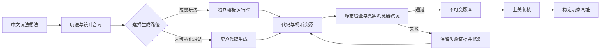
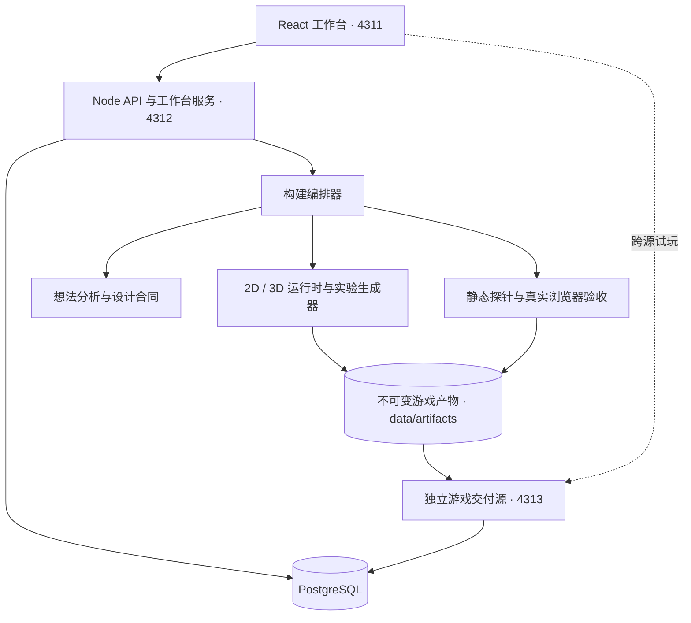

# AI Game Studio / AI 游戏工坊

一个中文优先、本地优先的 AI 游戏制作平台。创作者用一句话描述玩法，系统将想法整理成可检查的游戏合同，选择成熟运行时或实验生成通道，构建真实可玩的 2D / 3D 网页游戏，并通过自动检查、真实浏览器试玩、不可变版本和稳定玩家网址完成交付。

它不是聊天框套壳，也不把一个游戏反复换皮。平台把规则、代码、素材、测试、版本和发布放在同一条可追溯的制作链中。

> 当前状态：可在本地完整运行的工程版本，适合产品验证、游戏模板研发和 AI 生成管线实验；尚不是可直接承载公网多租户业务的完整 SaaS。

[快速开始](#快速开始) · [成熟玩法](#成熟玩法) · [系统结构](#系统结构) · [配置](#配置) · [质量与安全](#质量与安全) · [许可证](#许可证与第三方边界)

## 核心能力

| 能力 | 当前实现 |
| --- | --- |
| 中文创作入口 | 从一句玩法描述生成维度、视角、机制、硬约束、难度和输入方式等结构化合同 |
| 成熟游戏起点 | 12 类独立 2D 玩法，每类都有自己的规则、关卡、输入、结算和运行时 |
| 实验生成通道 | 没有成熟模板能承载的想法，可由模型生成独立 2D HTML 或受约束的 Three.js 3D 场景 |
| 2D / 3D 交付 | Canvas 2D 游戏，以及第三人称 3D 收集闯关和小型竞技场 |
| 专业设计合同 | 目标玩家、玩家幻想、核心循环、胜负条件、难度曲线、手感、引导、无障碍和风险 |
| 独立视听资源 | 模板封面、背景、图集、精灵、环境声、操作声、成功与失败反馈均随项目归档 |
| 自动质量闸门 | 静态探针、脚本解析、规则检查、响应式检查和真实浏览器状态流验收 |
| 可恢复构建 | 构建步骤、状态、输出和失败原因写入数据库；服务重启后不会永久卡在“制作中” |
| 版本与发布 | 每次成功构建形成不可变版本；稳定玩家网址可发布新版本或回滚到历史版本 |
| 游戏大厅 | 只展示已经通过质量检查、主美复核并正式发布的游戏 |
| 跨源隔离 | 工作台和玩家游戏使用不同端口或域名，降低生成代码接触工作台数据的风险 |
| 项目生命周期 | 支持制作对话、重新构建、归档、恢复，以及对已归档项目的永久删除 |

## 成熟玩法

创建页面目前提供以下 12 个成熟起点：

| 玩法 | 代表项目 | 已实现重点 |
| --- | --- | --- |
| 俄罗斯方块 | 折光堆叠 | 旋转、暂存、直接落下、消行、速度递增和手机触控 |
| 图片拼图 | 植光拼图 | 6—50 块、真实咬合边、自由拖拽、邻接成组、上传图片和外围整理 |
| 打砖块 | 漆海碎星 | 20 个砖阵、连击能力、挡板控制、失败恢复和分阶段压力 |
| 华容道 | 朱门华容 | 20 个求解器验证布局、直接拖动、撤销、重做、提示和步骤回放 |
| 迷宫 | 苔径迷庭 | 20 个可解关卡、雾、冰、钥匙门、限量提示和手机滑动 |
| 贪吃蛇 | 青玉长游 | 20 个场型、双转向缓冲、障碍、金果、暂停恢复和结算统计 |
| 数字合成 | 数织矩阵 | 2048 规则、下一块预告、滑动、连续位移动画、回溯和任务目标 |
| 太空射击 | 星环突围 | 持续移动、自动火力、三波敌人、主动能力、首领和移动端拖动 |
| 多格拼块 | 软糖拼岛 | 20 个原创可解轮廓、旋转、直接拖放、非法回弹、分层提示和恢复 |
| 方块填阵 | 果冻填阵 | 三选拼块、横竖消行、旅程、无尽、每日挑战和局内恢复 |
| 区域逻辑 | 星灵巡格 | 一星到二星规则、20 个唯一解关卡、解释型提示、撤销和重做 |
| 肉鸽麻将 | 月港雀旅 | 自由牌配对、可解牌阵、航段推进、遗物选择和局间成长 |

“星梦对决”作为固定黄金游戏单独存在，用于回归验证共享棋盘、玩家与 AI 回合、特殊构形、技能、障碍和局内恢复。

平台跳跃已退出成熟模板目录。相关 2D 创意只会进入实验生成通道，不会被包装成已经稳定的模板；3D 收集闯关中的跳跃和高度碰撞能力不受影响。

## 一次创作如何完成



主要产物不只是一份游戏代码。每个构建还会保留游戏设计、创作方向、资源清单、来源说明、自动检查结果、浏览器截图、版本信息和发布状态。

## 系统结构



工作台、API 和玩家游戏共享项目与版本数据，但玩家游戏由独立来源提供。生产环境应把工作台与游戏交付源放在两个不同的 HTTPS 域名下。

## 快速开始

### 环境要求

- Node.js 24
- npm
- Docker Engine 或 Docker Desktop，并支持 Compose v2
- `npm ci` 会自动准备与 Playwright 匹配的 Chromium；已有 Chrome 或 Edge 也可以直接使用

### 获取和启动

```bash
git clone https://github.com/mmlong818/ai-game-studio.git
cd ai-game-studio
npm ci
npm run db:up
npm run dev
```

Windows PowerShell 可以把 `npm` 替换为 `npm.cmd`。

启动后可访问：

| 地址 | 用途 |
| --- | --- |
| `http://127.0.0.1:4311/` | Vite 开发工作台 |
| `http://127.0.0.1:4311/#projects` | 项目列表 |
| `http://127.0.0.1:4311/games` | 已发布游戏大厅 |
| `http://127.0.0.1:4312/api/health` | API 与数据库健康状态 |
| `http://127.0.0.1:4313/play/<slug>/` | 稳定玩家网址，由实际发布项目产生 |
| `http://127.0.0.1:4313/version/<version-id>/` | 不可变版本网址 |

第一次启动 API 时会确保“星梦对决”黄金项目存在。其他示范游戏不会自动灌入数据库。

### 生成示范游戏

保持开发服务运行，在另一个终端执行：

```bash
npm run seed:showcases
```

脚本会创建、构建并发布 12 款示范游戏；已经存在的同名项目会被复用，不会反复创建副本。

### 完整检查

```bash
npm run check
```

该命令依次执行类型检查、完整测试和前后端生产构建。也可以单独运行：

| 命令 | 作用 |
| --- | --- |
| `npm run typecheck` | TypeScript 类型检查 |
| `npm test` | 合同、规则、数据库、产物和真实浏览器测试 |
| `npm run build` | 构建前端和服务器 |
| `npm run check` | 执行全部交付前检查 |
| `npm run db:logs` | 查看 PostgreSQL 日志 |
| `npm run db:down` | 停止本地 PostgreSQL |
| `npm run setup:browsers` | 单独安装或修复自动验收使用的 Chromium |

如果安装依赖时使用了 `--ignore-scripts`，浏览器不会自动下载。首次构建前需要补跑：

```bash
npm run setup:browsers
```

## 不配置 AI 密钥时能做什么

AI 密钥不是启动成熟模板的前置条件。

不配置密钥时，系统仍然可以：

- 使用本地关键词识别选择成熟玩法
- 生成模板设计合同和 20 关进度合同
- 使用仓库内完整视听资源构建游戏
- 执行静态检查、真实浏览器验收、版本和发布流程
- 创建、归档、恢复和删除项目

配置 OpenAI 密钥后，系统会增加结构化想法分析、题材化设计合同、动态封面和局内素材，以及未模板化玩法的实验代码生成。密钥可通过工作台会话设置、环境变量或本机密钥文件提供；真实密钥不会写入仓库。

## 实验生成通道

当成熟玩法无法承载用户想法时，项目可以进入 `generated` 通道。它与模板运行时是两条不同路径：

- 2D 项目由模型生成完整 HTML 游戏
- 3D 项目只允许使用随产物落盘的本地 Three.js 模块
- 生成代码禁止主动联网、外链资源、动态执行代码、读取 Cookie 和本地存储、创建 iframe 等高风险行为
- 每轮生成后执行静态扫描和真实浏览器状态流验收
- 浏览器必须真实经历开始、游玩、胜利、重开和失败，而不是只检查页面能否打开
- 违规或验收失败会把具体原因交回生成器限次修复；仍失败则保留失败记录，不发布伪成功版本
- 每次生成记录模型来源、轮次、文件哈希、规则落实审计和实现说明

实验通道证明的是“这份生成结果通过了当前自动合同”，不代表玩法深度已经达到成熟模板质量；正式发布前仍需要真人试玩和主美复核。

## 构建、版本和发布

一个项目会经历以下状态：

1. 创建项目并保存初始玩法合同。
2. 启动构建，逐步生成设计文档、运行时代码、素材和质量证据。
3. 静态探针与真实浏览器检查全部通过后，创建不可变版本。
4. 主美复核通过后，版本才能进入正式发布。
5. 稳定玩家网址指向选定版本；发布新版本只切换指向，旧版本网址保持不变。
6. 如新版本出现问题，可以把稳定网址回滚到历史合格版本。

生成产物默认保存在 `data/artifacts/`，数据库保存在 Docker PostgreSQL 卷中。`data/`、`.env`、依赖目录和构建输出均不会进入 Git。

## 配置

本地默认值可以直接启动；需要覆盖时使用环境变量。`.env.example` 是配置参考，Docker Compose 会读取项目根目录的 `.env`。

| 变量 | 默认值 | 说明 |
| --- | --- | --- |
| `HOST` | `127.0.0.1` | API 和游戏服务监听地址 |
| `PORT` | `4312` | API 与生产工作台端口 |
| `GAME_PORT` | `4313` | 独立游戏交付端口 |
| `PUBLIC_ORIGIN` | 根据 `HOST` / `PORT` 生成 | 工作台公开地址 |
| `PUBLIC_GAME_ORIGIN` | 根据 `HOST` / `GAME_PORT` 生成 | 玩家游戏公开地址；生产环境应使用独立域名 |
| `DATABASE_URL` | `postgresql://studio@127.0.0.1:54329/ai_game_studio` | PostgreSQL 连接地址 |
| `LEGACY_SQLITE_PATH` | `./data/studio.db` | 旧 SQLite 只读迁移来源；仅在新库为空时导入 |
| `STUDIO_ACCESS_TOKEN` | 未设置 | 设置后，除公开玩家端点外的工作台 API 需要 Bearer Token |
| `BUILD_CONCURRENCY` | `2` | 同时执行的构建数量 |
| `OPENAI_API_KEY` | 未设置 | 可选的 OpenAI API 密钥 |
| `OPENAI_API_KEY_FILE` | `./data/secrets/openai-api-key.txt` | 可选的本机密钥文件 |
| `NODE_USE_ENV_PROXY` | 未设置 | Node 通过系统 HTTP(S) 代理访问外部 API 时设为 `1` |
| `PLAYWRIGHT_CHROMIUM_EXECUTABLE_PATH` | 自动发现 | 手动指定 Chrome、Edge 或 Chromium 可执行文件 |
| `PLAYWRIGHT_SKIP_BROWSER_DOWNLOAD` | 未设置 | 设为 `1` 时跳过 `npm ci` 后的自动浏览器安装；Docker 镜像使用此设置并安装系统 Chromium |

如果设置了 `STUDIO_ACCESS_TOKEN`，浏览器工作台需要在同一来源下保存该令牌：

```js
localStorage.setItem("forge-access-token", "你的访问令牌");
```

不要把真实令牌写入源码、`.env.example`、Issue、日志或提交历史。

## 生产构建

### 本机生产模式

```bash
npm ci
npm run db:up
npm run build
npm run start
```

生产工作台由 `4312` 端口提供，游戏仍由 `4313` 端口独立提供。

### Docker Compose

```bash
PUBLIC_ORIGIN=https://studio.example.com \
PUBLIC_GAME_ORIGIN=https://play.example.com \
STUDIO_ACCESS_TOKEN=<强随机令牌> \
docker compose --profile app up -d --build
```

容器镜像会安装 Chromium，用于真实浏览器构建验收。反向代理需要把两个域名分别指向 `4312` 和 `4313`，并在代理层配置 HTTPS。生成项目保存在 `studio-artifacts` 卷，PostgreSQL 数据保存在 `studio-postgres-data` 卷。

## API 概览

API 以项目生命周期为中心：

| 方法与路径 | 用途 |
| --- | --- |
| `GET /api/health` | 服务和数据库健康状态 |
| `GET /api/projects` | 活跃项目列表 |
| `GET /api/projects/archived` | 已归档项目列表 |
| `POST /api/projects` | 创建项目并生成初始合同 |
| `GET /api/projects/:id` | 项目详情 |
| `POST /api/projects/:id/build` | 启动构建 |
| `GET /api/projects/:id/build` | 最近一次构建状态 |
| `GET /api/projects/:id/messages` | 制作对话记录 |
| `POST /api/projects/:id/messages` | 添加下一次重建使用的创作意见 |
| `GET /api/projects/:id/versions` | 不可变版本列表 |
| `POST /api/projects/:id/versions/:versionId/art-review` | 提交主美复核结果 |
| `POST /api/projects/:id/publish/:versionId` | 发布指定合格版本 |
| `POST /api/projects/:id/archive` | 归档项目 |
| `POST /api/projects/:id/restore` | 恢复项目 |
| `DELETE /api/projects/:id` | 永久删除已归档项目及其生成文件 |
| `GET /api/games` | 已正式发布的游戏 |
| `POST /api/play-events` | 匿名玩家质量事件 |

创建、构建、制作意见、试玩遥测和通用 API 都有按客户端 IP 划分的内存限流。生产部署还应在反向代理层增加请求体限制、连接限制、TLS、安全日志和持久化速率控制。

## 目录结构

```text
ai-game-studio/
├─ assets/                     模板封面、图集、精灵、关卡图片和声音
├─ docs/                       产品、架构、研究、验收和设计决策
├─ fixtures/                   固定黄金游戏及其静态资源
├─ scripts/                    开发、种子、质量基线和批量审计脚本
├─ src/
│  ├─ server/                  API、数据库、构建、生成、验收和发布
│  │  └─ game-runtimes/        12 类成熟 2D 游戏运行时
│  ├─ shared/                  输入合同、游戏规格、模板来源和关卡进度
│  └─ web/                     React 工作台、游戏大厅和偏好设置
├─ tests/                      单元、合同、数据库、产物和浏览器测试
├─ third_party/                随项目分发的第三方许可证文本
├─ docker-compose.yml          PostgreSQL 与生产应用编排
├─ Dockerfile                  Node + Chromium 生产镜像
└─ package.json                命令、依赖和构建入口
```

## 质量与安全

项目把“生成成功”和“发布成功”分开处理。

- 所有用户输入先通过 Zod 边界校验
- 成熟模板拥有规则级测试、20 关进度合同和模板专属浏览器验收
- 实验代码同时接受静态安全扫描、脚本解析、状态机检查和真实浏览器验收
- 生成游戏不能直接读取数据库凭证，也不能访问工作台 Cookie
- 玩家游戏使用单独端口或域名，工作台 CSP 只放行明确的游戏来源
- 成功构建生成不可变版本；发布只是改变稳定网址的指向
- 服务重启会把悬空任务标为可重试失败
- 归档项目不会出现在常规项目列表和游戏大厅中
- 永久删除只允许作用于已归档项目，并同步清理生成文件
- OpenAI 会话密钥不会在设置状态接口中回传
- `.gitignore` 排除数据库、真实 `.env`、密钥、日志、依赖和构建目录

## 当前边界

- 这是本地优先的单工作区工程，不是已经完成的公网多租户平台
- 成熟模板覆盖的是明确列出的 12 类 2D 游戏，不承诺任意提示都能达到同等完成度
- 3D 当前重点是有限场地的收集闯关与小型竞技场，不包含开放世界、复杂骨骼动画或实时多人
- 实验生成结果通过的是自动合同，不等同于商业游戏质量保证
- 本地限流使用内存状态，不适合作为多实例生产限流器
- 本地生成产物使用文件系统，生产规模化仍需要对象存储、CDN、队列和可观测性
- 排行榜、实时多人、完整场景编辑器、团队协作和创作者商业化尚未完成

## 开源来源与资产政策

部分成熟玩法借鉴或移植了明确许可的开源规则结构，当前登记的来源包括 2048、Radius Raid、mkgame-poly、mkgame-blocks、Star Battle / mkgame-sudoku 和 Whatajong。

接入原则：

- 代码许可和媒体许可分开核验
- 只移植登记过的规则、状态机或求解结构
- 不默认复制上游图片、字体、音乐、音效、题库、关卡和品牌识别
- 每个来源记录接入方式、许可证地址、实际借鉴内容和资产边界
- 来源不清或许可证冲突的内容不得进入交付包

完整台账见 [开源小游戏模板筛选与接入记录](docs/OPEN_SOURCE_GAME_TEMPLATE_RESEARCH.md)。第三方许可证文本见 [`third_party/`](third_party/)。

## 许可证与第三方边界

仓库当前没有项目级 `LICENSE` 文件。代码可以被公开阅读，但在项目所有者明确添加许可证之前，这个仓库不能被视为已经授予第三方复制、修改或再分发权限的标准开源项目。

如果准备公开发布开源版本，需要先完成：

1. 由项目所有者选择项目许可证。
2. 添加根目录 `LICENSE` 和必要的版权声明。
3. 再次核验原创美术、音频、字体和所有第三方素材的再分发权。
4. 保留 `third_party/` 中的上游许可证，并补全需要的 NOTICE 或署名。

这里不会自动把所有游戏素材归入第三方代码许可证，也不会在未授权的情况下替项目所有者选择许可证。

## 进一步阅读

- [产品愿景与能力边界](docs/00-product-vision.md)
- [产品需求与工作流](docs/02-product-and-workflow.md)
- [系统与 AI 编排架构](docs/05-system-architecture.md)
- [游戏托管、数据库与独立网址](docs/07-hosting-and-delivery.md)
- [无模板实验通道决策](docs/decisions/0005-experimental-generated-games.md)
- [最佳模板游戏持续改造计划](docs/37-best-template-reference-program.md)
- [商业级游戏设计方法](docs/34-commercial-gameplay-methodology.md)
- [开源小游戏模板筛选与接入记录](docs/OPEN_SOURCE_GAME_TEMPLATE_RESEARCH.md)

## 项目目标

平台最终要稳定证明的是一条可复用、可检查、可回退的游戏制作链：

> 中文想法 → 玩法合同 → 运行时或实验生成 → 游戏与资源 → 自动验收 → 真人复核 → 不可变版本 → 稳定玩家网址

新增能力只有在拥有真实规则、独立资源、测试证据和移动端表现后，才应进入成熟模板目录。
