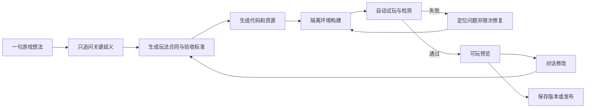
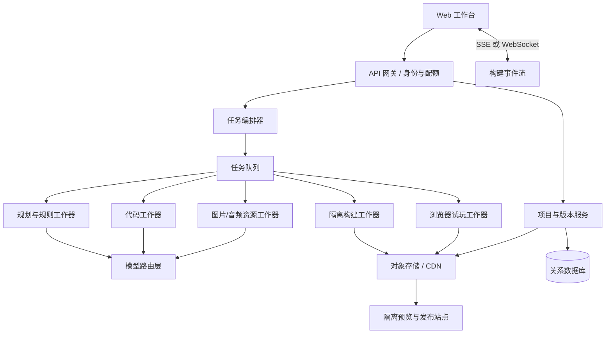

# AI 辅助生成游戏网站：资料归档与产品蓝图

> **范围校准（2026-08-26）**：长期产品是开放式多类型、2D/3D、多运行时游戏创作平台；三消与小型 2D 网页游戏只是第一批验证样例。当前有效的总体方案见 [产品愿景与能力边界](../00-product-vision.md)，本文保留为早期研究和第一交付切片记录。
> 文档性质：探索结论与首版实施蓝图，不是假装已经确定的最终 PRD。  
> 当前工作假设：首批用户从小型 2D 网页游戏进入，但平台架构和品牌承诺不以 2D 或固定玩法为上限。  
> 研究日期：2026-08-26。

## 0. 结论先行

建议做，但不要从“完整复制 MakePlay”开始。

最有胜算的第一交付切片是：

> 一个中文优先、面向非程序员的 AI 游戏工作台，让用户从一句想法出发，在 5—8 分钟内得到一款能在手机和电脑浏览器运行的小型 2D 游戏；同时明确展示制作计划、文件与资源变化、测试结果、失败修复和版本历史。

这不是普通的“聊天框生成一段游戏代码”，而是一条可以被用户理解和控制的生产线：



核心差异不应是“我们也能生成游戏”，而应是：

1. **制作过程可解释**：用户能看到计划、动作摘要、产物、失败和修复，但不暴露模型思维链或秘密提示词。
2. **交付结果可证明**：不仅说“完成了”，还显示加载、输入、核心规则、移动端布局和性能等测试证据。
3. **修改过程可回退**：每次修改形成版本，可比较、回滚、复制分支。
4. **需求转规则更可靠**：先把自然语言转换为明确玩法合同，再开始生成，减少“看起来像、玩起来不是”的结果。

## 1. 已整理的原始资料

本次资料分为三层，不能混写：

| 证据层级 | 已有内容 | 可以说明什么 | 不能说明什么 |
|---|---|---|---|
| 页面直接观察 | [MakePlay 制作监控记录](./makeplay-monitor-cmt92l3fq09xrorms4ijobycm.md) | 页面公开的步骤名、状态、产物、错误、修复与预览 | 服务器实际命令、完整请求体、系统提示词、完整代码差异 |
| 页面公开说明 | [MakePlay 后续公开的方法整理](./makeplay-revealed-methodology.md) | 它公开解释的需求分析、玩法设计、优先级和验收方法 | 未公开的内部编排规则和专有实现 |
| 官方公开资料 | MakePlay、Rosebud、GDevelop 官方网站 | 对外承诺的能力、工作流、版本与发布方式 | 产品内部真实架构和实现质量 |

### 1.1 页面直接观察到的生产链

目标项目是一款 AI 与玩家共享 8×8 棋盘的对战三消。页面公开过以下动作摘要：

- 查找工作区文件。
- 读取特效、Pixi 应用骨架、分享卡等制作手册。
- 搜索符石图片和中文像素字体。
- 编写美术、声音和游戏设计文档。
- 生成 11 张游戏图片、1 个字体、1 条背景音乐和 11 个音效。
- 多次修改 `game.ts`，生成封面和浏览器预览。
- 搜索与读取代码、增加调试钩子、反复执行 `PLAYTEST`。
- 发现并修复伤害统计重复、特效坐标、设备像素比布局、局间等待和重排回合保持等问题。
- 最终页面声明 `All AC-1..8 probed and ticked`，即 8 项验收已探测并勾选；但完整 AC 定义和探针代码没有公开。

这条链路证明了用户能看到的产品形态：**需求分析 → 设计文档 → 资源 → 代码 → 构建 → 自动试玩 → 修复 → 可玩版本**。

### 1.2 明确没有拿到的内容

页面没有向浏览器下发以下内容，因此当前资料中也没有：

- 完整系统提示词。
- 模型之间传递的完整提示词。
- 工具调用的完整参数 JSON。
- 服务器执行的真实 shell 命令。
- 完整源代码和每次修改的差异。
- AC-1 至 AC-8 的逐条原文与全部测试代码。

任何架构说明只应标为“建议实现”或“基于公开行为的推断”，不能伪装成 MakePlay 内部实现。

### 1.3 官方公开能力提供的参照

MakePlay 官方把产品描述为“用户负责方向，AI 负责构建”：自然语言提出想法后，系统生成代码、美术、音乐并试玩；用户可以在构建时继续排队发送修改意见，完成后直接在浏览器游玩和发布。其公开资料还提到 2D 使用 PixiJS、3D 使用 three.js、物理使用 Rapier，以及发布快照、版本和回滚能力。来源：[AI Game Builder](https://makeplay.ai/ai-game-builder)、[AI Game Maker](https://makeplay.ai/ai-game-maker)、[消息队列说明](https://makeplay.ai/blog/message-queue-jump-in)、[副本与版本说明](https://www.makeplay.ai/help/copies)。

可参考的相邻产品定位：

- Rosebud 强调自然语言生成代码、美术和声音，浏览器直接游玩，并允许编辑代码或导出，说明一部分用户在意“生成后还能自己掌控”。来源：[Rosebud AI Game Creator](https://rosebud.ai/ai-game-creator)。
- GDevelop 把 AI Agent 放在结构化游戏引擎里，让它修改场景、对象和事件；官方同时强调原型不等于成品，仍需要调试、发布、模板、资产和社区能力。来源：[GDevelop AI Agent](https://gdevelop.io/blog/make-games-with-ai-agent-gdevelop-automated-prompt)、[为什么 AI 仍需要游戏引擎](https://gdevelop.io/blog/why-use-gdevelop-when-you-can-use-ai)。

由此可见，这一品类的真正竞争不是单次代码生成，而是**完整制作闭环、生成结果的可控性、验证可信度和持续迭代体验**。

## 2. 产品探索结论

### 2.1 目标用户假设

首版只服务一类主用户：

> 有游戏想法，但不会搭引擎、写代码或组织美术音频资源，希望尽快做出可分享小游戏的人。

典型场景：

- 内容创作者做一个与视频、IP 或活动配套的小游戏。
- 教师把知识点变成可互动的课堂游戏。
- 独立创作者快速验证玩法，而不是先学一套专业引擎。
- 普通玩家把脑中的点子做成能发给朋友玩的链接。

暂不把专业游戏工作室作为首要用户。专业团队通常需要更强的工程控制、多人协作、完整源码资产管线和商业发行能力，会把首版范围迅速拖成通用游戏引擎。

### 2.2 用户真正要完成的任务

用户不是来“调用模型”的，而是要完成五件事：

1. 把模糊想法变成能玩的规则。
2. 在不了解技术的情况下知道系统正在做什么。
3. 尽快看到第一版并亲手玩到。
4. 用自然语言指出问题并可靠地修改。
5. 保存一个稳定版本，分享给别人。

### 2.3 最大障碍

- 用户不相信“一句话生成”真的能生成可玩的东西。
- 生成过程耗时且不透明，用户容易以为卡死。
- AI 会误解规则，做出表面相似但核心循环错误的游戏。
- 每次修改可能破坏已经正常的部分。
- 生成素材的来源、授权、隐私和成本不清楚。
- 浏览器里能打开不代表输入、移动端、胜负或重开真的可用。

### 2.4 产品承诺

首版承诺应该克制：

> 从一句中文想法开始，系统帮你澄清关键规则、生成一款小型 2D 浏览器游戏、自动走完核心试玩路径，并给出可回退的版本。

不要承诺：

- 任意类型都能高质量生成。
- 一句话直接得到商业成品。
- 复杂联网多人游戏。
- 3A、MMO 或大型开放世界。
- 零成本无限生成图片、音乐和代码。

## 3. 首版范围

### 3.1 必须有：P0

| 模块 | 首版能力 | 完成标准 |
|---|---|---|
| 想法输入 | 中文自然语言描述，可附一张参考图 | 能提取类型、核心循环、操作、胜负、时长和风格 |
| 关键澄清 | 最多追问 3 个真正改变玩法的问题 | 用户可直接接受推荐项，不陷入长问卷 |
| 玩法合同 | 生成可编辑的规则、范围和验收清单 | 开始构建前，用户知道第一版会做什么、不做什么 |
| 任务编排 | 按明确状态机执行规划、生成、构建、测试和修复 | 页面刷新后仍能恢复状态，不靠前端假进度 |
| 游戏运行时 | 只支持 2D 浏览器游戏，统一输入、音频、尺寸和生命周期接口 | 桌面与手机浏览器可运行，支持重开和暂停 |
| 代码生成 | 在受限项目骨架中生成游戏模块 | 不允许任意依赖和任意网络访问，构建可复现 |
| 资源生成 | 图片、字体、基础声音资源有清单和来源元数据 | 每个资源可预览、替换，失败时有占位回退 |
| 实时过程 | 显示动作摘要、当前阶段、产物、错误和重试 | 不显示模型思维链，不伪造服务器命令 |
| 可玩预览 | 隔离 iframe 中加载最新成功版本 | 加载失败不会拖垮工作台；可切换桌面/手机画幅 |
| 自动试玩 | 检查加载、画布、输入、核心状态、重开、尺寸和基本性能 | 测试结果逐项可见，失败项能关联到修复尝试 |
| 对话修改 | 用户用“目标 + 当前问题 + 希望变化”继续迭代 | 新版本保留旧版本，修改前生成变化摘要 |
| 版本管理 | 自动保存成功构建，可命名、比较、回滚 | 回滚不会覆盖原版本；版本有来源提示和时间 |
| 发布 | 生成不可编辑的公开快照和分享链接 | 发布版本与编辑中的草稿隔离，可撤下 |

### 3.2 建议限定的首批玩法

首版不开放无限类型。底层可先稳定支持三类：

1. **单屏益智**：三消、推箱子、连线、反应点击。
2. **俯视角动作**：移动、射击、躲避、收集、限时生存。
3. **横版平台**：移动、跳跃、收集、简单敌人和终点。

这不是让用户先选模板，而是用三种受控的运行时合同覆盖大多数核心机制，减少 AI 随意创造项目结构导致的构建失败。

### 3.3 后续再做：P1 / P2

P1：

- 源码查看和有限编辑。
- 分支副本与版本差异。
- 更完整的素材替换、局部重生成和裁切工具。
- 分享卡、嵌入网页、基础访问统计。
- 轻量排行榜和异步挑战。
- 更多游戏类型与结构化组件。

P2：

- 3D、物理和复杂关卡编辑。
- 真正的在线多人对战。
- 社区、评论、点赞、重混和创作者主页。
- 桌面包、应用商店导出和商业化 SDK。
- 团队协作、权限和品牌工作区。
- 玩家经济、付费素材市场和收益分成。

## 4. 用户流程

### 4.1 首次创建

1. 用户输入：“做一个两分钟一局的海底躲避游戏，手机单手玩。”
2. 系统提取硬约束，并只询问会改变实现的歧义，例如“竖屏还是横屏”“碰撞即结束还是有生命值”“更偏轻松收集还是紧张生存”。
3. 系统给出一页玩法合同：核心循环、控制、终点、P0、暂不包含、预计消耗和验收标准。
4. 用户确认后进入制作，不要求先懂技术栈。
5. 制作页按时间线显示已执行动作、生成资源、构建状态、失败和修复。
6. 第一版通过最低验收后自动打开预览。
7. 用户试玩并说：“鱼太慢，障碍太密，得分提示不明显。”
8. 系统显示变化范围，生成新版本并回归测试未修改的核心规则。
9. 用户选定一个稳定版本发布。

### 4.2 构建中的用户控制

- **排队补充**：不打断当前原子步骤，在下一阶段合并需求。
- **立即纠偏**：安全停止当前阶段，保留已完成产物，以新规则重新规划。
- **暂停**：停止新任务入队，正在运行的构建安全收尾。
- **取消本次版本**：保留上一个成功版本，不删除整个项目。

这些状态必须由后端真实任务状态驱动；不能只改变按钮文字。

### 4.3 失败体验

错误信息分三层：

- 用户层：“手机竖屏测试中，开始按钮被遮挡，正在修复布局。”
- 技术摘要：“DPR=2 时顶部控件超出安全区。”
- 原始日志：只在用户主动展开时显示，并过滤令牌、路径和内部机密。

如果自动修复达到次数或预算上限，应交付最后一个成功版本，并明确说明未完成项，不能无限循环消耗。

## 5. 工作台界面蓝图

### 5.1 设计简报

| 项目 | 方向 |
|---|---|
| 是什么 | 响应式 AI 游戏制作工作台，不是单纯聊天页 |
| 为谁 | 不会编程但有明确创意的中文用户 |
| 主要目标 | 尽快从想法到亲手玩到，并对过程有信心 |
| 气质 | 创意工作室、可信、清楚、有游戏感但不幼稚 |
| 用户顾虑 | “AI 会做出坏掉、俗套、不可修改的东西” |
| 产品钩子 | “一句话不是结果，第一版可玩才是。” |
| 约束 | 中文优先、手机可玩、测试可见、版本可回退、成本可控 |

### 5.2 桌面信息架构

```text
┌──────────────────────────────────────────────────────────────────┐
│ 项目名   v7 · 已通过   预算/耗时        设备切换   保存版本  发布 │
├────────────────┬──────────────────────┬──────────────────────────┤
│ 制作时间线      │ 当前计划 / 变化范围   │ 可玩预览                 │
│                │                      │                          │
│ 需求与澄清      │ 玩法合同              │  [桌面 / 手机]           │
│ 设计与资源      │ 本次改动              │                          │
│ 代码与构建      │ 验收标准              │                          │
│ 测试与修复      │ 文件和素材             │                          │
│                │                      ├──────────────────────────┤
│ [输入修改要求]  │                      │ 测试结果 / 日志 / 控制台  │
└────────────────┴──────────────────────┴──────────────────────────┘
```

三个区域承担不同问题：

- 左侧回答“系统刚做了什么、现在在做什么”。
- 中间回答“这次到底要做什么、会改哪些内容、如何算完成”。
- 右侧回答“现在能不能玩、哪些测试通过或失败”。

移动端不要把三栏硬挤成窄列，而应变为“制作 / 计划 / 试玩”三个一级页签；预览进入沉浸模式后保留明显返回入口。

### 5.3 视觉方向

- 以暖灰或深石板中性色作为 70%—90% 的工作台底色，用一个明确强调色表达“当前制作动作”。
- 避免常见的紫蓝渐变 AI SaaS 外观；建议尝试“石墨 + 灼橙”或“暖灰 + 青绿”，最终以真实对比度测试决定。
- 状态色只表达语义：绿色通过、黄色等待、红色失败、蓝色运行，不拿状态色当装饰。
- 中文正文优先使用可稳定加载的中文无衬线字体；日志和文件名使用等宽字体。全页控制在 6—8 个字号层级。
- 使用同一套线性图标，不混用 emoji、字符箭头和多套图标库。
- 所有交互有键盘焦点，触控目标至少约 44×44 像素；不能只靠悬停揭示关键操作。
- 版本、选中阶段、预览设备和测试标签要进入 URL 状态，刷新和返回键不能丢失上下文。

## 6. 建议技术架构

### 6.1 总体结构



### 6.2 不要一开始堆很多“自治 Agent”

首版建议使用：

- 一个确定性的后端状态机负责阶段、重试、预算和权限。
- 一个高质量规划/编码模型负责关键判断。
- 一个便宜快速的模型负责摘要、分类和低风险修改。
- 图片、音频和浏览器测试作为有清晰输入输出的工具。
- “策划、程序、美术、QA”可以是同一编排器下的角色化任务，不必先做成四个互相自由对话的 Agent。

原因是多 Agent 自由协作会迅速增加成本、延迟、不可预测性和调试难度。用户需要的是稳定生产线，而不是观看 AI 开会。

### 6.3 构建状态机

建议的真实状态：

```text
DRAFT
  → CLARIFYING
  → PLAN_READY
  → GENERATING_ASSETS
  → GENERATING_CODE
  → BUILDING
  → SMOKE_TESTING
  → REPAIRING（有限次数）
  → PLAYABLE
  → PUBLISHED

任何阶段还可能进入：PAUSED / CANCELLED / FAILED_BUDGET / FAILED_MANUAL_REVIEW
```

每个状态必须具备：

- 明确输入和输出。
- 幂等任务标识，避免刷新或网络重连导致重复生成与重复扣费。
- 最大执行时间、最大重试次数和最大预算。
- 结构化错误类型，而不是只有自然语言日志。
- 可恢复点，失败后不从头重做所有资源。

### 6.4 游戏运行时合同

首版统一使用成熟的 2D Web 渲染层，例如 PixiJS，但 AI 不直接控制整个应用壳。生成游戏只实现受限接口：

```ts
interface GeneratedGame {
  mount(container: HTMLElement, services: GameServices): Promise<void>;
  pause(): void;
  resume(): void;
  restart(): Promise<void>;
  destroy(): void;
  getDebugState?(): SerializableDebugState;
}
```

平台壳负责：

- 画布创建、缩放与安全区。
- 鼠标、键盘、触控和手柄的标准输入映射。
- 音频解锁、音量和静音。
- 生命周期、暂停、重开、截图和分享卡。
- 错误捕获、帧率采样和调试探针。
- 资源加载、缓存和失败回退。

这会比让模型每次重新发明入口、输入、音频和布局可靠得多。

### 6.5 项目数据模型

| 实体 | 关键内容 |
|---|---|
| `project` | 所有者、标题、目标用户、当前分支、隐私状态 |
| `branch` | 来源版本、当前草稿、用途、创建者 |
| `game_spec` | 硬约束、核心循环、操作、终点、风格、非目标 |
| `acceptance_criterion` | 验收描述、探针类型、状态和证据 |
| `build` | 输入版本、状态、预算、模型配置、开始结束时间 |
| `build_event` | 时间、阶段、动作摘要、公开参数摘要、错误、产物引用 |
| `artifact` | 代码、图片、字体、音频、构建包、来源与授权元数据 |
| `test_run` | 环境、步骤、断言、截图、控制台和性能数据 |
| `version` | 不可变文件快照、玩法合同、测试结论、父版本 |
| `publication` | 指向稳定版本的公开快照、域名、状态和访问统计 |

`build_event` 必须从一开始设计好。它既是制作时间线的数据源，也是恢复任务、计费审计和排查故障的基础。

## 7. AI 编排方法

### 7.1 从自然语言到玩法合同

规划阶段只做四类转换：

1. **硬约束**：用户明确说过、不能自行覆盖的内容。
2. **歧义**：不同答案会显著改变核心循环或成本的问题。
3. **偏好**：视觉、声音和氛围，可以后改。
4. **非目标**：首版明确不实现的内容。

将输入转为结构化合同：

```json
{
  "promise": "玩家在两分钟内控制小鱼躲避障碍并收集发光贝壳",
  "coreLoop": ["移动", "躲避", "收集", "强化反馈", "继续生存"],
  "controls": ["单指拖动"],
  "endCondition": "碰撞三次或倒计时结束",
  "hardConstraints": ["竖屏", "手机单手操作", "一局约两分钟"],
  "nonGoals": ["联网多人", "关卡编辑器", "账号成长"],
  "acceptanceCriteria": []
}
```

这不是最终内部提示词，而是你自己的公开产品协议；用户能读、能改、能追责。

### 7.2 生成顺序

建议顺序：

1. 确认玩法合同和验收标准。
2. 生成最小代码骨架与程序化占位资源。
3. 先验证 P0 核心循环能玩。
4. 再生成正式图片和音频并替换。
5. 执行全量自动试玩与回归测试。
6. 修复失败项，达到上限则转人工确认。
7. 保存不可变成功版本。

与观察到的 MakePlay 顺序相比，这里把“程序化占位版本”提前，是为了降低图片或音乐生成失败对核心玩法验证的阻塞。正式视听方向仍应在写最终实现前锁定。

### 7.3 公开过程，不公开思维链

对用户显示：

- 动作名：`生成玩法合同`、`创建角色资源`、`构建网页版本`、`验证触控输入`。
- 必要参数摘要：游戏类型、画幅、目标文件、测试环境。
- 产出：文件、图片、音频、构建版本和截图。
- 状态：等待、执行、通过、失败、重试、需要确认。
- 错误原文和用户能理解的解释。

不显示：

- 模型隐藏思维链。
- 平台系统提示词。
- 服务端令牌、内部路径和未过滤环境变量。
- 可被利用来突破沙箱的底层执行细节。

可以公开“输入摘要、工具动作、结果和理由”，这已经足以建立信任。

## 8. 自动试玩与验收

### 8.1 基础冒烟测试

所有游戏都必须检查：

- 页面和画布成功加载，无未处理异常。
- 游戏进入可操作状态，而不是永远停在加载画面。
- 鼠标、键盘或触控中的目标输入生效。
- 重开后关键状态确实重置。
- 竖屏、横屏和高设备像素比下不溢出、不遮挡。
- 静音、后台恢复和页面尺寸变化不会使游戏崩溃。
- 帧率和内存没有明显失控。

### 8.2 玩法验收

规划模型根据玩法合同生成结构化验收项，例如：

| 验收项 | 自动探针 | 可见证据 |
|---|---|---|
| 玩家能移动 | 注入触控轨迹，比较角色坐标 | 前后截图 + 状态差异 |
| 收集会加分 | 把角色移动到收集物，读取分数 | 分数变化 + 事件日志 |
| 碰撞会扣生命 | 触发已知碰撞 | 生命值变化 + 受击反馈截图 |
| 三次受击结束 | 连续触发三次碰撞 | 结算页出现 |
| 重开恢复初始状态 | 点击重开并读取状态 | 生命、分数、计时归零 |

不要让测试只依赖截图识别。生成游戏应提供只读、序列化、受控的调试状态和测试动作入口；发布版本可关闭或严格限制这些入口。

### 8.3 回归策略

- 每次修改先标出受影响的合同条款和文件。
- 至少重跑基础冒烟、受影响的验收项和一条核心完整流程。
- 如果修改输入、尺寸、生命周期或公共运行时，重跑所有游戏级基础测试。
- 保存测试环境、浏览器版本、画幅、设备像素比和证据截图，避免“之前通过”无法复现。

## 9. 安全、隐私与版权

### 9.1 生成代码必须隔离

- 构建工作器运行在一次性容器或同等级隔离环境中，禁止访问宿主机和其他用户项目。
- 默认禁止生成代码访问任意外部网络，只允许平台代理的白名单资源。
- 限制 CPU、内存、进程数、构建时间、包体和文件数量。
- 不允许任意安装依赖；使用审核过的依赖白名单和锁定版本。
- 预览放在独立来源域名或严格 sandbox 的 iframe 中，配置 CSP，隔离 Cookie、存储和窗口权限。
- 对上传文件做类型、大小、内容和恶意载荷检查；对压缩包防路径穿越和压缩炸弹。
- 日志在入库前过滤密钥、令牌、连接串、用户路径和第三方响应中的敏感内容。

### 9.2 用户数据

如果提示、聊天和参考图会发送给第三方模型，必须在上传前说清楚处理方、用途、保存策略和删除方式。MakePlay 的隐私政策也明确提到会收集提示、聊天、参考图及发布内容，并把提示或图片发送给模型提供商，这说明这不是可以藏在长条款里的小问题。来源：[MakePlay Privacy Policy](https://www.makeplay.ai/privacy)。

首版至少需要：

- 私有项目默认不公开。
- 可删除项目及其派生资源。
- 发布前再次确认公开范围。
- 未成年人、人物肖像、版权角色和违法内容的基础审核。
- 明确区分平台自带资源、AI 生成资源、用户上传资源和第三方资源。

### 9.3 独立实现边界

MakePlay 的使用条款明确限制使用其服务开发竞争服务、反向工程或获取专有组件。因此，这个项目应基于通用产品模式、你自己的需求和公开技术文档独立实现；不要复制其代码、私有提示词、素材、未公开接口或专有工作流。来源：[MakePlay Terms of Service](https://www.makeplay.ai/terms)。

这份蓝图只采用可公开观察的产品能力和通用工程原则，并明确保留了“不可见”的证据边界。

## 10. 成本与商业模式

### 10.1 主要成本来源

- 规划和代码模型的输入输出 token。
- 图片生成和局部重生成。
- 音乐、音效与语音生成。
- 隔离构建的 CPU、内存和存储。
- 浏览器自动试玩和截图。
- 发布包 CDN 流量。
- 失败修复循环造成的重复消耗。

### 10.2 首版控费规则

- 每次构建先显示预计信用点区间。
- 每个阶段有预算上限，达到上限暂停并交付最后成功版本。
- 相同玩法合同和未变化资源使用内容哈希缓存。
- 小修改只重做受影响部分，不重新生成全部素材。
- 优先用程序化图形、平台资源库和轻量音效完成 P0；用户确认方向后再花费高成本生成正式素材。
- 自动修复限制次数，例如同一失败最多 2—3 次，随后转为明确错误报告。

### 10.3 商业模式假设

更合理的早期方案是“免费试玩额度 + 按月创作者套餐 + 额外信用点”：

- 免费：少量项目、有限构建、公开发布、带平台标识。
- 创作者：更多私有项目、更多生成额度、版本历史、去标识和基础导出。
- 团队版后置：共享资产、多人协作、审批和品牌工作区。

不要在产品价值尚未验证时先建复杂的金币、抽奖或社区经济系统。

## 11. 建设路线

以下周期假设有 2—3 名有经验的全栈/AI 工程师和兼职产品设计支持；实际周期取决于现有基础设施和模型供应商。

### 阶段 A：可行性样条，2—3 周

目标：证明“自然语言 → 可玩 → 自动测试 → 修复”可以闭环。

- 固定一个 2D 运行时和一个项目骨架。
- 只支持一种单屏游戏类型。
- 建立玩法合同 JSON。
- 生成 `GeneratedGame` 模块，隔离构建并预览。
- 实现 5 项基础探针和 3 项玩法探针。
- 保存构建事件和不可变版本。
- 用 20 个真实提示测试成功率、耗时和成本。

通过门槛：不是展示一个精心挑选的演示，而是 20 个提示中有足够比例能在预算内生成并通过最低验收；失败原因可以归类和复现。

### 阶段 B：封闭 MVP，6—8 周

- 支持三种受控玩法族。
- 完成创建、澄清、玩法合同、制作时间线、预览、修改、版本和发布全流程。
- 加入图片资源生成与替换。
- 完成移动端工作台和手机试玩。
- 建立配额、审计、内容审核、错误分类和基础运营后台。
- 邀请 30—50 名目标用户完成首次游戏。

### 阶段 C：公开测试，6—10 周

- 扩展类型和更可靠的局部修改。
- 增加源码查看、分支副本、分享卡和简单重混。
- 建立失败样本集、回归基准和模型路由评测。
- 根据留存和成本决定是否做 3D、社区、导出或教育专版。

## 12. 成功标准

首版不要用“生成了多少项目”作为唯一成功指标。建议同时看：

### 用户价值

- 首次创建到可玩预览的中位时间目标：不超过 8 分钟。
- 新用户首次会话成功玩到自己游戏的比例目标：至少 70%。
- 首次预览后主动提出一次修改并得到新版本的比例。
- 7 天内回来继续编辑、复制或发布的用户比例。
- 用户主观回答“生成结果符合我的核心想法”的比例。

### 可靠性

- 首次构建成功率。
- 基础冒烟测试一次通过率。
- 修改后引入回归的比例。
- 自动修复成功率和平均修复次数。
- 预览崩溃、输入失效和移动端布局失败率。

### 成本

- 每个成功可玩版本的平均模型与计算成本。
- 失败构建消耗占总成本的比例。
- 图片和音频重复生成率。
- 从创建到发布的单位成本和毛利空间。

这些数值是首轮目标，不是已经验证的行业基准。可行性阶段应根据真实数据重定。

## 13. 主要风险和对策

| 风险 | 真实后果 | 首版对策 |
|---|---|---|
| 类型过宽 | 成功率低、每个项目结构不同、难测试 | 先限制 2D 和三种玩法族 |
| 生成内容同质化 | 用户觉得只是换皮模板 | 用玩法合同驱动机制差异；视觉资源允许局部替换 |
| 修改破坏旧功能 | 用户不敢继续迭代 | 不可变版本、影响分析和自动回归 |
| 过程不透明 | 等待焦虑、误判卡死 | 真实事件流、阶段耗时、产物和失败可见 |
| 自动修复失控 | 成本和时间不可预测 | 状态机、预算、重试上限、最后成功版本兜底 |
| 生成代码不安全 | 数据泄露或基础设施受攻击 | 容器隔离、网络白名单、依赖白名单和预览隔离 |
| 素材授权不清 | 发布与商业使用有风险 | 全链路来源元数据、许可证记录和替换机制 |
| “能打开”冒充“能玩” | 用户拿到坏游戏 | 玩法合同、调试状态和真实流程探针 |
| 直接模仿竞品 | 法律和产品差异风险 | 独立实现，专注可解释与可验证，不复制专有内容 |

## 14. 当前最值得验证的三个问题

### 1. 用户是否愿意先确认玩法合同

它能显著提高正确率，但也可能让用户觉得“一句话生成”不够神奇。应测试两种体验：默认直接采用推荐项，和要求用户逐项确认；比较首次完成率和返工率。

### 2. 受控玩法族是否仍让用户感觉足够自由

如果限制太显眼，会被认为是模板工具；如果完全开放，可靠性会迅速下降。正确做法是在界面上让用户表达自然创意，在底层把需求映射到稳定的机制组件和运行时合同。

### 3. 测试证据能否真正建立信任

需要验证用户更关心哪种证据：逐项通过、自动试玩录像、前后截图、可展开状态数据，还是只关心“现在能玩”。首版都可记录，但界面不应默认淹没普通用户。

## 15. 首个垂直样条建议

第一款内部样例不要做三消复刻，建议做“竖屏单手海底生存”：

- 规则简单但包含连续输入、碰撞、生成物、计分、生命、倒计时和结算。
- 能验证手机触控、响应式尺寸、音频解锁、暂停恢复和重开。
- 视觉资源可明显更换，适合测试局部重生成。
- 自动探针容易构造，能证明玩法合同不是只测页面加载。

样条的成功标准：

1. 三种不同自然语言描述都能映射到同一运行时合同。
2. 首次生成可以玩完整一局。
3. 至少一次自然语言修改只改变目标内容，不破坏输入、结算和重开。
4. 测试页能给出可理解的通过/失败证据。
5. 任意失败不会丢失上一个成功版本。

## 16. 尚未决定、但不阻塞样条的产品选择

- 主市场是大众创作、教育互动还是内容营销。
- 国内优先还是全球优先；这会影响模型、支付、内容审核和部署。
- 是否允许下载源码，还是只提供网页发布与有限编辑。
- 用户对私有项目、商用授权和去平台标识的付费意愿。
- 图片和音乐采用自有生成、第三方模型、授权素材库还是混合方案。

在这些问题得到真实用户证据前，底层应保持供应商可替换，但不要为所有未来商业模式预建复杂抽象。

## 17. 最终判断

这是一个值得验证的方向，但最难的不是接入模型，而是建立稳定的“规则化、生成、运行、测试、修复、版本”闭环。

如果只做聊天生成 HTML，很快就能演示，却很难形成用户信任和长期价值。真正可用的产品应该把以下四件事同时做对：

1. 用户能自由表达创意。
2. 系统把创意约束成可执行、可验收的玩法合同。
3. 生成内容运行在稳定、受控、可测试的游戏壳中。
4. 每次修改都有证据、有版本、可恢复。

这也是建议首版押注“中文优先的可解释、可验证 2D AI 游戏工作台”，而不是追求全类型、全自动、一次成品的原因。
