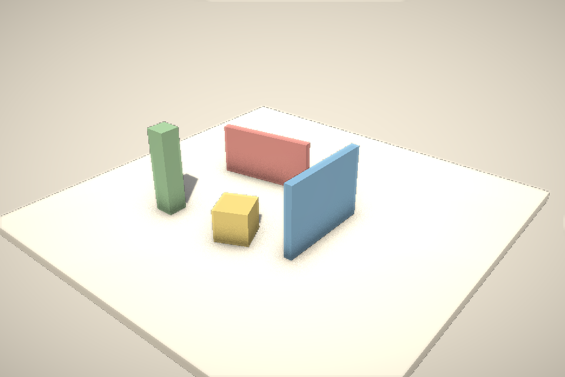

# Cocos 4 Web 运行时构建与门禁记录（2026-09-04）

> 结论：**门禁未通过，迁移停止。** 本目录**不含**引擎产物（`cocos.module.js` 未提交、`vendor/` 未写入），
> 只保留可复现的构建脚本、门禁空白页与证据。原因见 §4。

## 1. 来源

| 项 | 值 |
| --- | --- |
| 仓库 | https://github.com/cocos/cocos4 |
| 标签 / 提交 | `v4.0.0` → `6722aac66902b08c1effc376d77af579b4261560`（2026-09-02） |
| package.json | `cocos-creator@4.0.0-alpha.32`，`"license": "MIT"` |
| 仓库 LICENSE | MIT（Copyright (c) 2025 SUD） |
| 克隆体积 | 353 MB（`--depth 1`，含 `native/` C++），耗时 39 s |
| 本地位置 | `D:/codex/_external/cocos4`（仓库外，不入库） |

## 2. 构建（可用 `node scripts/build-cocos-engine.mjs` 复现）

1. `npm install --ignore-scripts`：Node 24.20 下 npm 自身 "AlignedAlloc Allocation failed"，需 `NODE_OPTIONS=--max-old-space-size=8192`（22 s）。
   跳过 postinstall 的原因：其中 `build:native-pack-tool` / `build:declaration` 与 Web 无关。
2. 手工执行 postinstall 中与 Web 相关的步骤：`node scripts/spread-pal.cjs`（把 `@cocos/engine-pal/dist` 复制到 `pal/`，190 个文件）、
   `npm run build:debug-infos`、`node scripts/spread-adapter.cjs`、`npm run build:const`。
3. `@cocos/ccbuild@2.3.21` `buildEngine`：
   ```js
   { moduleFormat: 'esm', platform: 'HTML5', mode: 'BUILD', split: false,
     features: ['base', 'gfx-webgl2', '3d', 'legacy-pipeline'],
     compress: false, inlineEnum: true, noDeprecatedFeatures: true,
     targets: ['chrome 100', 'safari 15.4', 'firefox 100'] }
   ```
   - 耗时 14–17 s，产物单文件 `cc.js`，无外部 import、无 `.wasm` 引用。
   - **必须指定现代 `targets`**：默认 ES5 降级触发 Babel 循环闭包 bug（`ReferenceError: _i is not defined`，`program-lib.ts insertBuiltinBindings`），首帧即崩。
   - `compress: true`（terser）在 Node 24.20 下 "Zone Allocation failed - process out of memory"（1.4 s 即崩），改用项目已有的 esbuild 压缩。
4. `esbuild --minify --format=esm --target=es2020`（0.3 s）→ `cocos.module.js`。

裁剪结果：只含 base + WebGL2 图形后端 + 3D（Node/Scene/Camera/Light/MeshRenderer/Material/EffectAsset/RenderTexture）+ 旧版前向管线（含 ShadowFlow）。
不含 2D、UI、粒子、骨骼、物理、小游戏适配层、自定义管线。

| 产物 | raw | gzip | brotli | 门禁（≤ 6 MB / gzip ≤ 1.5 MB） |
| --- | --- | --- | --- | --- |
| `cc.js`（未压缩 ESM） | 1.88 MB | 354 KB | 272 KB | — |
| `cocos.module.js`（esbuild 压缩） | 0.96 MB | 269 KB | 217 KB | **通过** |

## 3. 空白页验证（`gate/`）

`gate/index.html` + `gate/paper-effect.js` + `gate/paper-post.js`，用 `gate/shot.mjs`（本地静态服务 + Playwright Chromium，SwiftShader）截图：

- `game.init({ overrideSettings: { rendering: { customPipeline: false }, assets: { preloadBundles: [] }, ... } })` 17 ms，`WebGL2Device`，`ForwardPipeline`。
- Director / Scene、透视 Camera、DirectionalLight + 固定区域阴影贴图（`shadowFixedArea`，1024²，R32F）、5 个程序化 Mesh（自建顶点 / 法线 / 顶点色，`utils.createMesh(..., { calculateBounds: true })`）。
- 后处理：主相机 `targetTexture` → RenderTexture（RGBA8 + DEPTH_STENCIL），第二个正交相机绘制全屏四边形，
  采样颜色 + 深度纹理（`rt.window.framebuffer.depthStencilTexture`，经 `pass.bindTexture`），实现 **SSAO 接触阴影 + 软 bloom + 暗角**。
- 截图：`gate/gate-render.png`（未压缩与 esbuild 压缩产物渲染结果逐字节一致）。



### 3.1 必须知道的技术事实

- **引擎没有任何可用的内建着色器。** `editor/assets/effects/*.effect`（builtin-standard / unlit / pipeline/* / 后处理）是源码格式，
  需要 Cocos Creator 编辑器内置的**离线 effect-compiler** 编译成 EffectAsset JSON；该编译器不在仓库中、npm 上也没有
  （`@cocos/effect-compiler` 404）。`builtinResMgr.loadBuiltinAssets` 依赖编辑器打出的 `internal` bundle，纯引擎构建下为空。
  → 门禁里所有材质（前向 Lambert + 阴影接收、shadow-caster、后处理）都是**手写 EffectAsset**（glsl3、UBO 布局按 `cocos/rendering/define.ts` 对齐）。
  可行，但意味着 Cocos 的 PBR / 卡通 / 天空盒 / 自定义管线后处理全都不可直接用。
- 踩坑记录：材质属性 sampler 必须显式给 `samplerHash`；`cc.Camera` 渲染进 RT 时 `cc_cameraPos.w` 是组合符号码（WebGL 下为 3），
  阴影 UV 翻转仅在 `== 1.0` 时进行；`createMesh` 默认不算包围盒 → 没有 `worldBounds` 的模型会被阴影裁剪剔除；
  LDR / HDR 数值桶按设值时刻的 `pipelineSceneData.isHDR` 选择，需在场景激活后再设光照强度。
- 引擎会在 `import` 时查找 `#GameCanvas` 并自动包一层 `#GameDiv` / `#Cocos3dGameContainer`，会改动页面 DOM 结构。

## 4. 许可核对（门禁第 3 条：**不通过**）

| 包 | 版本 | license 字段 | 是否进入 Web 产物 |
| --- | --- | --- | --- |
| cocos/cocos4 仓库（`cocos/`、`exports/`、`external/`） | 4.0.0-alpha.32 | MIT | 是 |
| `@cocos/engine-pal` | 1.0.4 | **UNLICENSED**（README：「UNLICENSED — Cocos 内部使用」） | **是**（`pal/screen-adapter`、`pal/input`、`pal/env`、`pal/pacer`、`pal/system-info`、`pal/wasm` 全部打进 `cc.js`；dist 为混淆产物，无源码） |
| `@cocos/engine-platforms` | 1.0.6 | UNLICENSED | 否（仅小游戏 / 原生适配层） |
| `@cocos/ccbuild` | 2.3.21 | MIT | 否（构建工具） |
| `external/compression`（zlib.js）、`external/deserialize`（notepack） | — | MIT（`licenses/LICENSE_notepack.io.txt`） | 部分 |
| `licenses/*`（FreeType、PhysX、spine、libpng …） | — | 各自许可 | 否（均为 native/ 依赖） |

- Cocos 4 在 v4.0.0 把平台抽象层（PAL）从引擎源码中移出，改为闭源 npm 包（`scripts/spread-pal.cjs` 注释称之为 "pal-platforms-privatization"）；
  GitHub 上无 `cocos/engine-pal` 公开仓库（404），cocos4 issue 中无相关澄清。
- 因此按其 README 构建出的任何 Web 运行时都**必然内含无再分发许可的代码**，不能作为 `engineLicense: "MIT"` 的 `vendor/cocos.module.js` 随产物分发，
  也不能提交到 `third_party/`。这不是体积或工程量问题，而是权利问题，没有"补丁式"解法。

## 5. 若日后重新评估

- 触发条件：上游为 `@cocos/engine-pal` 补上开源许可（或把 pal 源码回归仓库），且提供可用的 effect 编译链（CLI 或开源 effect-compiler）。
- 备选（未采用，工程量与风险都不小）：用 cocos-engine 3.8.x（MIT）的 `pal/` 源码按 `engine-pal/dist/**/*.d.ts` 契约重写 Web 子集（约 20 个文件、~80 KB 混淆代码对应的功能），
  并自行维护全部着色器。这等于维护一个 Cocos 4 分叉，超出「直接迁移」的范围。
- 重新评估时直接运行 `node scripts/build-cocos-engine.mjs`，脚本会重新输出体积与许可门禁结论。
